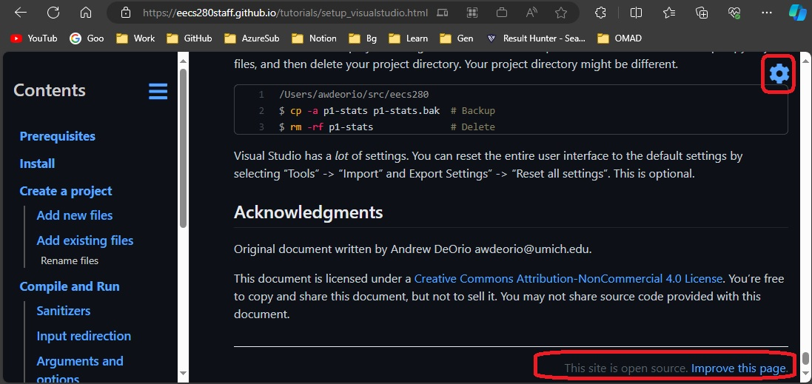
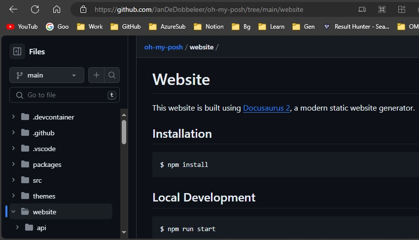

# BuildWebPortal

    A repo to document how to build a Web portal.

## Objective

1. The web portal is to be hosted on cloud company. But the content on github.

## Some sample web portals.
1. https://wpfui.lepo.co/
   1. Scroll down and click the **Edit this page**
   2. https://github.com/lepoco/wpfui/blob/main/docs/index.md/
 
2. https://www.vsixcookbook.com/
   1. Scroll down till the end and click the **Edit this page**
   2. https://github.com/VsixCommunity/docs/blob/main/docs/index.md

3. https://dotnet.github.io/docfx/
   1. Scroll down till the end and click the **Edit this page**
   2. https://github.com/dotnet/docfx/blob/main/docs/index.md/

4. https://mapsui.com/
   1. On the right side, look for **improve this Doc**
   2. https://github.com/Mapsui/Mapsui/blob/master/docfx/index.md/

5. https://www.reactiveui.net/
   1. Click Documentation. You will be taken to https://www.reactiveui.net/docs/
   2. Then on the right side, click Edit Content. 

6. https://eecs280staff.github.io/tutorials/setup_visualstudio.html
   1. On top right, you will see a gear icon. Click it.

      

   2. Scroll down, you should see **This site is open source. Improve this page.*
   3. https://github.com/eecs280staff/tutorials

7. Oh my posh 
   1. https://ohmyposh.dev/docs/installation/fonts
   2. https://github.com/JanDeDobbeleer/oh-my-posh/tree/main/website

      

   3. https://docusaurus.io/

## Some Static content generator tools
   1. https://dotnet.github.io/docfx/
      1. https://github.com/dotnet/docfx

   3. https://github.com/statiqdev/Statiq.Framework

   4. https://github.com/statiqdev/Statiq.Web

   5. https://github.com/Wyamio/Wyam

   6. https://docusaurus.io/