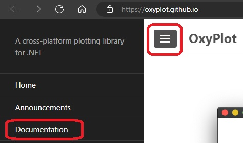
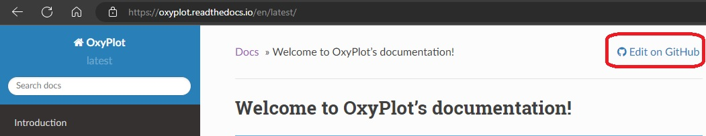
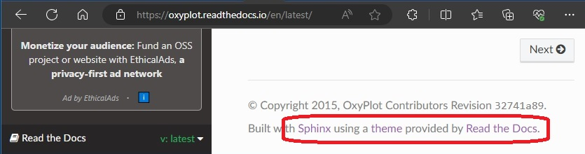

## Read the Docs

## Some sample web portals.
1. https://oxyplot.github.io/
   
   1. Go to the above link and more links icon as shown below.  
   
        

   2. Click Documentation. You will be taken to https://oxyplot.readthedocs.io/en/latest/
   
   3. Then we have.
    
        
   
   4. https://github.com/oxyplot/docs/blob/master/index.rst

        

   5. 

2. 